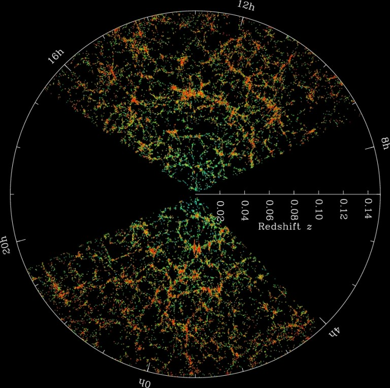

# Detail for CHEA Works

## Statistical study on morphologies of Leo filaments via Deep learning method with transductive labels

- **Intro & Problem** : 거대우주구조 시뮬레이션에서 Cluster, Filament, Wall Classification

    우주의 질량은 75%가 암흑 에너지, 20%가 암흑 물질, 그리고 5%가 바리온 이라 불리는 우리가 알고있는 모든 물질들의 총칭이다. 그 중, 5% 바리온 분포들을 관측하였을때, (Fig 1) 균등하게 분포있는게 아니라 물질들이 밀집되어있는 부분, 비어있는 부분이 확연히 들어난다 ([Pancake Theory](https://en.wikipedia.org/wiki/Zeldovich_pancake)).  물질들은 크게 **Galaxy of Clusters, Galaxy of Filaments, Wall, Void** 구조로 형성되어있다. 

    이중 **Galaxy of Clusters**는 나머지 구조들과는 다른 확연한 물리적 특성 (온도, 밀도, Xray)을 가지지만 **Filament, Wall** 의 물리적 특성 차이는 크게 다르지않다. 따라서, **Filament**와 **Wall**을 구분 하기위해선 물리적 특성 뿐만 아닌, 구조가 가지는 전반적인 기하학적 정보도 함께 정의해서 사용해야 적절한 결과가 도출 될 것이다.

    💠 **Cluster**는 구형으로, 다른 2개의 구조에 비해 온도와 밀도가 월등히 높다.
   
    💠 **Filament**는 3차원상에서 원통형이며 온도와 밀도가 상대적으로 wall 보다 높다
    
    💠 **Wall**는 3차원상에서 평면구조이며 온도와 밀도가 상대적으로 filament 보다 낮다

{: width="20" height="20"}
Fig 1. Large scale structure of the universe 
Ref: Sloan Digital Sky Survey

Fig 2. Cluster, Filament, Wall, Void 
Ref: [Paper (Link)](https://www.semanticscholar.org/paper/A-machine-learning-approach-to-galaxy-LSS-I.-on-Hui-Aragon-Calvo/3376717081ed443ca09c689a261717a3a3675511)

- **Previous Research & Limitation:** 한정적인 수학적 정보만 사용

    기존의 연구들은,  물리학적 정보를 사용하지 않고 기하학적 정보들만으로 **Filament**와 **Wall**을 구분하는 시도를 하였다.

    1. [Hessian Matrix](https://en.wikipedia.org/wiki/Hessian_matrix) (논문 [참조 1](https://arxiv.org/abs/1401.7866), [참조 2](https://arxiv.org/abs/1209.2043)) 를 계산한 뒤, 그것에 대한 Eigenvalue값을 조합하여 특정 포인트의 Contextual한 기하학적 정보를 계산한다. (예를들어, Filament와 같은 원기둥안에 속해 있는 포인트에서는 Eq. 1의 Filament 값이 상대적으로 높게 나올것이다.)  

        

        Eq 1. Shape Strength. for each lambda means Eigenvalue of Hessian Matrix  
        Ref: [Paper (Link)](https://arxiv.org/abs/1209.2043) 

    2. 또 다른 접근으론 ([참조](https://academic.oup.com/mnras/article/414/1/350/1090746?searchresult=1)),  위상수학에서 사용되는 [Morse Theory](https://en.wikipedia.org/wiki/Morse_theory)를 통해 정의한다. 3차원 공간상에서 분포하는 물질들을 파악하여, 특정부분으로 나누었을때 가장 안정화되는 포인트를 찾아 공간을 decomposition하는 방법이다. 

    이러한 방법들이 기존 연구에 사용되었지만 물리적 특성 (온도, 밀도 등)을 사용하지 못했다.  대체적으로 **Filament**가 온도와 밀도가 **Wall**보다 높다고 알려져 있었지만 이러한 물리적 특성을 사용하기에 예외적인 케이스와 상황에 따라 다를때가 많아 기존의 물리학에서 사용되는 방법론으로는 사용하기 어려움이 있었다.

    **따라서, 특정한 Criteria으로 나누기 힘든 기준들을 머신러닝/딥러닝을 이용하여 물리적/기하학기적 정보를 모두 포함하여 Filament와 Wall을 구분하는 방향으로 연구를 진행하였다.**

- **Data:** Big data of Simulated Large Scale Structure of the Universe ****

     [논문](https://ui.adsabs.harvard.edu/abs/1993ApJ...414....1R/abstract) 에 언급된 코드를 (Fortran) 사용하여 여기에서 나온 데이터를 이용하였다.

    거대우주구조 시뮬레이션 데이터는 하나당 약 32GB이며 총 8개를 사용하였다. 기본 포맷은 Binary 데이터이다.

- **Machine Learning Approach:** Transductive label를 사용한 Label Spreading 기법 사용
    - Method:

        1. **Data Preparation** :  
        Cluster 주변에 특정 크기로 데이터를 Crop한 후,  [Gaussian Pyramid](https://en.wikipedia.org/wiki/Pyramid_(image_processing))방법으로 Smoothing을 한다. (Fig 3, 4)   -  [Code Link](https://github.com/swha0105/Private/blob/master/Research/Filaments/cluster_box_gen.py), [Code Link2](https://github.com/swha0105/Private/blob/master/Research/Filaments/retired_v4/pyramid.py)

        (**Cluster**주변에 **Filament**와 **Wall** 이 존재 한다고 알려져있다).

        

        2. **Data Processing & Label assign**: 

        1에서 준비 된 데이터에 온도, 밀도, Xray, 그리고 **Shape strength** 을 이용하여 4차원 데이터 공간을 만든다. - [Code Link](https://github.com/swha0105/Private/blob/master/Research/Filaments/gpu_signature.py) (Gpu 가속)

        그 후, 물리적으로 식별이 가능한 **Cluster**와 **Void**를 Label로 생성 한 뒤, 나머지 부분들을 **Filament**와 **Wall**의 집합으로 생성한다. 

        4차원 데이터 공간상에서 **Filament**는 **Cluster**와, **Wall**은 **Void**와 상대적으로 가까울 것으로 추측된다. 따라서 4차원 공간상에서 거리를 계산하는 Label Spreading을 사용하여 각 Voxel에 대해 **Filament**와 **Wall**에 대한 추론을 하였다.

        -  [Code Link](https://github.com/swha0105/Private/blob/master/Research/Filaments/label_spreading_v2.py)

        3. **Do Label spreading!** - [Code Link](https://github.com/swha0105/Private/blob/master/Research/Filaments/label_spreading_v2.py) 

    - Result

    

    Fig 5. Density around cluster (Left), Result of Label Spreading (Right)

    > Label Spreading한 결과, 각각의 Filament들이 잘 segment된 것으로 보여진다. (총 샘플 78개 확인), 평가할 Metric이 없어, Filament의 물리적 특성을 통계적으로 분석하여 판단 (아래 Result에 서술)

- **Deep Learning Approach:** 3D-Unet을 이용한 Segmentation 시도
    - Method
        1. **Label Generation:**
        Label Spreading에서 생성된 Label들 중에, 후 처리가 필요한 Filament segment에 대해 연결 한 후 Label 생성. (Fig. 6) - [Code Link](https://github.com/swha0105/Private/blob/master/Research/Filaments/matlab/spreding_to_post.m)

            

            Fig 6. Label from Label spreading (left), Label after post processing (Right(

        2. **Image processing & Augmentation:**
        number of image: ****1280 |  augmentation: X 8 (x,y,z flipped) 
         ⇒ Total number of image: 10240
        For training: 8000, For Validation: 2240
        ****
        3. Do 3D-Unet! - [Code link1](https://github.com/swha0105/Private/blob/master/Research/Filaments/models/unet_models.py)  , [Code link2](https://github.com/swha0105/Private/blob/master/Research/Filaments/models/model_run_val.py)

    - Result

        

        Fig 7. Dice Coefficient for training, Validation.

        > Voxel 단위로 segmentation 하는 3D-unet은 연속적인 물체를 segmentation하는데 한계가 있었다. Validation coefficient가 data가 늘어남에도 불구하고 더 향상되지 않았고, segmented된 data들도 연속적이지 않은 segmentation이 많았었다. 

         💠 3D-unet은 본 연구 프로젝트에 맞지 않는것으로 판단.
              Label Spreading에서 나온 data를 사용하기로 결정

- **Post Processing:** Matlab을 이용한 Volumetric data 처리
    - Method:
        1. **Skeletonization:**
        Filament들을 개별로 식별하기 위해 Label Spreading 에서 계산된 Filament들을 Skeletonization을 한다 - [Code Link](https://github.com/swha0105/Private/blob/master/Research/Filaments/matlab/skeleton.m) (Matlab)

            

            Fig 8. Example of Skeletonized 

        2. **Select proper direction on branch point:**

            Galaxy of Cluster의 중심에서 출발하여 하나의 Galaxy of Filament끝에 도달하기 까지 수많은 Branch Point들이 존재 하였다. Galaxy of Filament 하나에 대해 여러가지 Voxel 집합으로 정의 되면 안되기에 이 중 가장 적절한 길찾기를 통해 Galaxy of Filament를 정의 하여야 했다.

            Branch Point에서 중심에서 Endpoint까지 가는 모든 경우의수를 계산 한뒤, branch의 각도와 xray값을 고려하여 가장 높은 점수를 가지는 경우의수를 proper direction이라 정의한다. - [Code Link](https://github.com/swha0105/Private/blob/master/Research/Filaments/prefer_direction.py)

            이와 같은 정의는 관측 논문들을 참조 하였으며 (Ref 5) 관측 결과에서 Galaxy of Filament를 정의할때, 원래의 진행방향을 유지한 채, 가장 밝은 구간으로 정의하는 방법을 사용하였기에 이와같은 방법을 수치와 하여 Proper direction을 정의하고 사용하였다.

            

            Fig 9. Schematic of choosing proper direction

- **Result**

    ### 총 40개정도의 cluster에서 segmentation된 105개의 Filament에 대한 물리량들을 구해보았다.

    > 기본적으로, Filament가 잘 segmentation 되었는지 확인하기 위해 구해 볼수 있는 **Linear density**를 구해보았다. 기존 논문과 (ref. 2) 오더 하나 (factor of 10) 정도의 차이를 보았지만, Filament의 굵기나 시뮬레이션 배경 환경을 고려해보았을때 충분히 **reliable한 결과**라고 생각된다.

    

    Fig 10. Linear Density versus Length (Left: Linear density in Ref 6, Right: Linear Density in our data)

    또 다르게 구해 볼수 있는 물리량으론 Curvature가 있다. 기존 연구에서는 데이터 처리상의 한계로 Filament를 2Mpc/h 로 Smoothing을 해주어야 했기 때문에 Curvature가 0.5 이상인 Highly Curved Filament들을 식별하는데 한계가 있었다. 

    최근 관측 결과에서 우리은하가 속해있는 Virgo cluster에서 Curvature가 0.5 정도인 Highly Curved Filament가 발견되었기 때문에, 기존 연구에서 수행하지 못한 Curvature계산을 통해 이와 같은 Highly Curved Filament가 시뮬레이션 데이터 상 통계적으로 얼마정도의 시그마 값을 가지는지 확인을 하였다.

    

    Eq 2. Curvature equation in 3-dimension

    > Curvature를 구하는 Eq 2. 를 사용하기 위해, Filament들을 각각 3차 오더로 Fitting하고 Curvature를 구했다. - [Code Link](https://github.com/swha0105/Private/blob/master/Research/Filaments/curvature_v2.py)
    Fig 10. Filament 하나에 대한 가장 큰 curvature와 (Left), Filament 하나의 모든 voxel에 대한 curvature에 대한 평균값이다 (Right).
    앞서 Highly curved를 가진 Leo filament가 0.5정도의 값을 가진다고 했기에, 우리 데이터에서 추출한 filament 100개중 하나정도의 Highly curved를 가진다는걸 알 수 있다. 이에 Highly curved로 판별된 Filament가 과연 관측이 가능할 정도의 크기인지, Reliable한 Filament인지 알아 볼 필요가 있었다.

    

    Fig 11. Curvature statistics

    > 따라서, Length와 Curvature에 대한 관계도를 보아, Curvature와 Length에 대한 상관관계를 알아볼 필요가 있었다. Fig. 12에서 보이듯이,  0.5이상 curved를 가지는 filament는 length 가 15 Mpc/h 에서 형성이 되는걸 알 수 있다. 위와 같은 크기는 관측이 되기 어려우며 길이가 짧으므로 **Filament라고 정의 내리기가 쉽지 않을 것으로 생각이 된다.**

    

    Fig 12. Curvature versus Length

    **따라서, Highly curved filament가 실제로 존재하는가를 판단하기 위해선 좀 더 많은 데이터가 필요로 할 것으로 판단이 된다.**

    

### Summary

위와 같은 일련의 과정으로 Machine Learning을 도입하여 Large Scale Structure of the universe에서의 Galaxy of Filament를 segmentation 및 Identification하는 작업을 하였다.

결론적으로, Filament를 segmentation 하는 작업은 성공하였으나, 이를 과학적인 결과와 연관시키고 결과가 논문화가 되러면 좀 더 많은 데이터가 필요로 할 것으로 판단이 된다 (Highly curved filament problem). 이 데이터는 굉장히 cost가 비싼 데이터로 하나를 생성하는데 있어 3~4개월이 걸릴 예정이다.

Code works은 끝났으니, 데이터가 생성되는대로 좀 더 테스트를 할 예정이다.

reference
[1] [https://aip.scitation.org/doi/pdf/10.1063/1.3382336](https://aip.scitation.org/doi/pdf/10.1063/1.3382336)

[2] [https://arxiv.org/abs/1209.2043](https://arxiv.org/abs/1209.2043)

[3] [https://www.semanticscholar.org/paper/A-machine-learning-approach-to-galaxy-LSS-I.-on-Hui-Aragon-Calvo/3376717081ed443ca09c689a261717a3a3675511](https://www.semanticscholar.org/paper/A-machine-learning-approach-to-galaxy-LSS-I.-on-Hui-Aragon-Calvo/3376717081ed443ca09c689a261717a3a3675511)

[4] [https://academic.oup.com/mnras/article/414/1/350/1090746?searchresult=1](https://academic.oup.com/mnras/article/414/1/350/1090746?searchresult=1)

[5] [https://arxiv.org/abs/1611.00437](https://arxiv.org/abs/1611.00437)

[6] [https://arxiv.org/abs/1401.7866](https://arxiv.org/abs/1401.7866)

-
