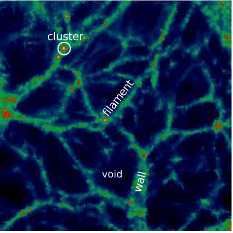
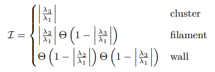
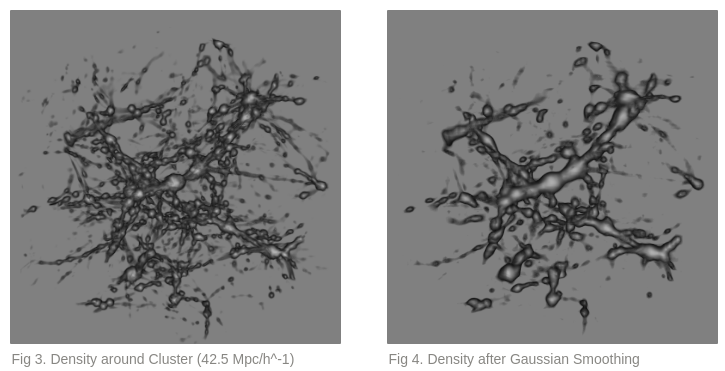
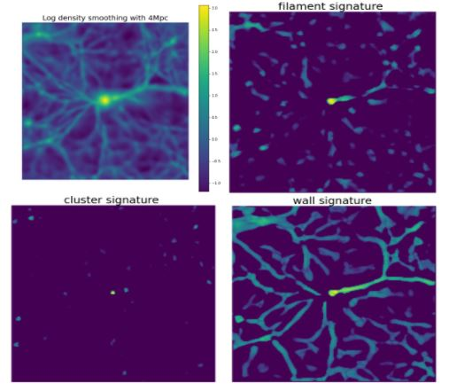
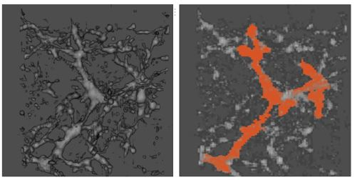
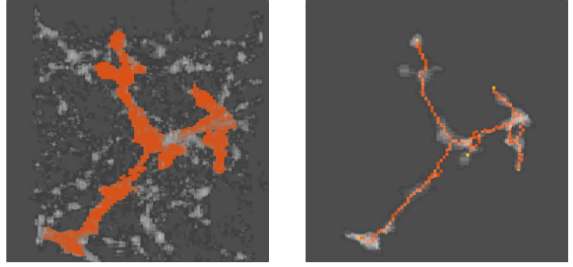
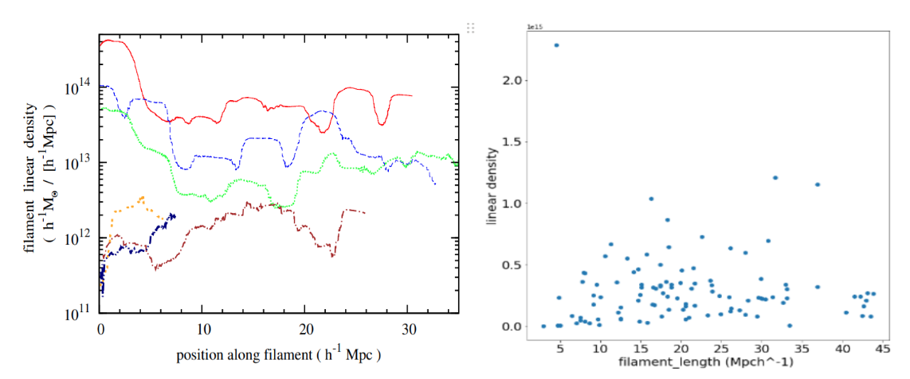
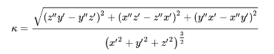
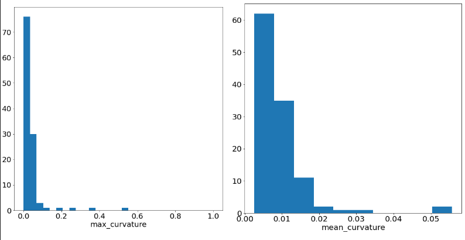
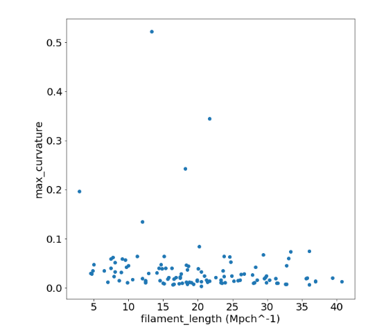

# **Filament Identification via Machine Learning**
이건 제목으로 

 

***

## **Project Info**
### Statistical study on morphologies of Leo filaments via Label spreading 
- **기간:** 19.09 ~ 21.01
- **주관 및 관련 기관:**  CHEA(Center for High Energy Astrophysics) ,선도연구센터
- **사용 언어** : Python, MATLAB
- **사용 기술** :
    - Label Spreading (Machine learning),
    - DFS(Depth-First Search), 
    - 3차원 이미지 처리(Gaussian pyramid, Skeletonization)
    - gpu 가속
 
 

***
## **Intro & Problem** : 
<!-- **거대우주구조 시뮬레이션에서 Cluster, Filament, Wall Classification** -->

현재 인류가 관측 할 수 있는 가장 큰 우주를 보았을 때, 우주에 존재하는 물질 들은 균등하게 분포해있지 않고 특정한 구조를 가지며 분포 해있다. 전체 우주의 물질분포와 그 구조를 `거대우주구조` 라고 하며 이 거대우주구조에는 `Galaxy of Clusters`, `Galaxy of Filaments`, `Wall`, `Void` 의 구조가 존재한다.
<!-- ([Pancake Theory](https://en.wikipedia.org/wiki/Zeldovich_pancake)) -->
각 구조들은 다음과 같은 성질을 가진다.  

💠 `Galaxy of Clusters` 는 구형으로, 다른 구조들에 비해 온도와 밀도가 월등히 높다.

💠 **`Galaxy of Filaments`** 는 3차원상에서 **원통형**이며 온도와 밀도가 상대적으로 Wall 보다 높다

💠 **`Wall`** 는 3차원상에서 **평면구조**이며 온도와 밀도가 상대적으로 Filament 보다 낮다

💠 `Void` 는 매우 낮은 밀도와 온도를 가지고 있다.

이 중 **`Galaxy of Filament`** (이하 `Filament`)는 우주 전체 물질 질량의 50%를 차지하지만 부피는 6%를 차지하는 구조로서 우주의 물질들이 굉장히 밀집되어 있어 흥미로운 물리현상들이 많이 일어나는 곳이다. [참조 논문](https://academic.oup.com/mnras/article/441/4/2923/1213214)

`Filament`는 3차원 공간상에서 복잡한 원통형 구조를 띄고 있으며 이 원통을 따라 수많은 물리현상들이 (ex: cosmic ray acceleration) 일어난다. 따라서 거대우주공간에서 일어나는 흥미로운 물리현상을 알아내기 위해 이 `Filament`를 시뮬레이션 데이터상에서 구분하고 식별하는 일은 필수적이라 할 수 있다.
하지만 이 `Filament`는 다른 구조 특히, `Wall`과 구분하기 힘든 성질을 가지고 있다.

`Filament` 와 `Wall`은 `Cluster` 주변에 분포하고 전체적인 구조와 물리량(밀도, 온도, Xray)이 오차범위 안에서 비슷한 값을 가진다. 전문가들은 이 둘을 구분하기 위해 **물리량과 함께 3차원 기하학적 정보를 모두 고려하여** 종합적인 판단을 내린다. 

이러한 접근을 모방하기 위해 **Deep Learning**의 **3D-Unet** 과 **Machine Learning** 의  **Label spreading** 을 사용하였다.  또한 실제 우주의 관측데이터가 부족하고 불완전함으로 우주 구조를 묘사하는 시뮬레이션 데이터를 통해 구조를 분석하고 통계량을 계산해 실제 관측데이터와 비교하는 접근을 하였다. 

이를 통해 우리는 특히 `Filament`의 **`Curvature`** 를 계산을 하였다. 실제 관측데이터에서는 Curvature가 큰 Highly curved Filament가 많이 나오지만 시뮬레이션 데이터 상 아직까지 보고 된 바가 없음으로 ML을 통한 Filament Identification이 모든 데이터에 성공적으로 적용할 수 있다면 무수히 많은 Filament들의 통계값을 통해 Highly curved Filament의 존재 유무와 존재 확률을 통계적으로 접근 할 수 있기 때문에 Identification 후 Curvature 계산에 집중하였다. 

모든 코드들은 **Python** 으로 구성했으며 3차원 데이터의 후처리 및 시각화는 **MATLAB** 의 3D Volumetric Image Processing 모듈을 사용하였다.

 

     
    

Ref: Sloan sky survey(left), [Paper link](https://arxiv.org/pdf/1803.11156.pdf)(right)

 
 

***
## **Data:**
본 [논문](https://ui.adsabs.harvard.edu/abs/1993ApJ...414....1R/abstract) 에 언급된 코드를 (Fortran) 이용해 계산된 데이터를 이용하였다.  
Size: 32GB x 8   
Format: Binary (3차원)

 
 

***
## **Previous Research & Limitation:**

기존의 연구들은,  물리학적 정보를 사용하지 않고 기하학적 정보들만으로 `Filament` 와 `Wall` 을 구분하는 시도를 하였다. 

1.  3차원 밀도공간에서 [Hessian Matrix](https://en.wikipedia.org/wiki/Hessian_matrix) 의 Eigenvalue를 계산해 **Shape strength** 를 구성하는 방법이 있다. 각각의 **Shape Stength** 는 특정 포인트에서의 주변 밀도의 구조를 고려해 **구, 원기둥, 평면** 정도 를 나타낸다. **Shape Strength**를 이용해 `Filament` 와 `Wall`의 후보군을 찾아낸 뒤, 알려진 물리량과 함께 `Filament`를 판단한다 ([논문 1](https://arxiv.org/abs/1401.7866), [논문 2](https://arxiv.org/abs/1209.2043))
    

         
    

    Eq 1. Shape Strength. for each lambda means Eigenvalue of Hessian Matrix 
 

2. 위상수학에서 사용되는 [Morse Theory](https://en.wikipedia.org/wiki/Morse_theory)를 이용하여 3차원 공간의 밀도분포에서 가장 안정화된 Saddle point들을 찾아 이를 잇는 선을 찾아내여 `Filament` 를 정의하는 것이다. 오픈소스 코드로 배포가 되어있으나 현재 우리가 사용하는 데이터 형태와 호환이 불가능하다.
[논문 1](https://academic.oup.com/mnras/article/414/1/350/1090746?searchresult=1)
 
 

기존 연구방법에서는 위의 방법을 이용하여 기하학적 정보를 사용하였다. 하지만 기하학적 정보와 데이터에 존재하는 물리적 정보 (온도,밀도,xray)를 동시에 사용할 수 없고 기하학적 정보 처리 뒤 후 처리로 처리해야하는 번거로움이 있었다. 또한 이 방법의 가장 큰 한계는 Filament와 Wall에 대한 정량적인 Criteria가 없어 전문가가 데이터 마다 기준을 세우고 분류를 해야하는 번거로움이 존재하였다. 

**전문가의 개입 없이, 데이터에 의존성없이 정량적인 Criteria를 만들어 데이터에 대한 Bias를 없애기 ML/DL 접근을 시도 하였다**

 
 

***

## **Approach** : 
  
1. **Gaussian Pyramid를 통한 데이터 압축**  -> code 링크   
`Filament` 와 `Wall`은 `Cluster`주변에 존재하기 때문에 데이터를 `Cluster` 주변 40~45Mpc/h 의 크기로 Crop하였다.  Crop을 한 데이터들도 크기가 250~300Mb 하기 때문에 ML/DL에 사용하기 적합하지 않았다. 따라서 Gaussian Pyramid 알고리즘을 2번 적용해 데이터를 압축하였다. 이 과정에서 기하학적 정보가 손실 되지 않았는지 체크하였고 아래 그림과 같이 확인 하였다
  

가우시안 피라미드 설명 한거 링크..

 

2. **GPU 병렬화를 통한 Signature 및 Shape strength계산** -> code 링크  
기존 연구방법을 참고하여 기하학적 정보를 **Shape Signature**를 계산하여 사용하기로 하였다. 
**Shape Signature**는 밀도 데이터의 **Hessian Matrix**를 구성하여 **Eigenvalue**를 계산하고 [논문](https://arxiv.org/abs/1401.7866)에 나온대로 적절히 조합하여 **Shape Strength**을 계산한다.  
이는 주변의 밀도분포를 고려하여 특정 포인트가 어떤 형태를 띄고 있는지 숫자로 나타내준다. 이 과정은 매우 큰 계산자원을 필요로 하기에 **GPU를 이용한 가속화**를 하여 CPU로 처리했을때에 비해 약 10~100배 정도 빠른속도를 구현하였다. 
 

 
위의의의 그림은 왼쪽 위부터 시계방향으로 `Density`, `Filament signature`, `Wall signature`, `Cluster signature`를 나타낸다. 

 

 
3. **Label Spreading을 통한 Filament 식별** -> code 링크  
Label spreading에 대한 자세한 설명은 여기로.. (링크)  
**Label spreading**은 개수가 적지만 확실한 Label를 통해 Unlabeled 데이터에 Label을 지정 알고리즘으로 **Semi-supervised Learning** 중 하나 이다.    
거대우주구조 4가지 구조중 `Cluster`와 `Void`는 물리량으로 정확히 정의가 된다. 
또한, `Filament`는 `Cluster`와, `Wall`은 `Void`와 상대적인 물리량 및 기하학적으로 비슷한 특성을 가진다.   
이를 이용해 `Cluster`와 `Void`를 X-ray 및 온도를 이용하여여 정확히 정의 한 뒤 이를 **Label**로 가정한다. Label의 **기하학적 정보와 물리량들**을 이용해 Unlabeled 데이터 안에 존재하는`Filament`와 `Wall`에 대한 **Classification**을 한다. 

 
왼쪽 그림은 밀도, 오른쪽 그림은 Label spreading이후 `Filament`라 Classification 된 부분을 의미한다. 
 

4. **MATLAB을 통한 후처리 및 DFS를 통한 Filament 개별화** -> Skeleton 코드, DFS 코드
식별된 Filament를 하나씩 개별화화 하기 위해 MATLAB의 `3D Volumetric Image Processing`을 이용해 **Skeletonized**를 하였다.
 

 
Skeletonized된 데이터를 이용하여 Python의 모듈 `Networkx`을 이용해 **Graph** 화 하고 **DFS** 개념을 활용해 Cluster 중심에서 부터 Filament가 끝나는 지점까지 길찾기를 하여 필라멘트 개별화를 하였다.

 
 

***

## **Result**

### 총 40개정도의 cluster에서 segmentation된 105개의 Filament에 대한 물리량들을 구해보았다.  

### **1. Linear density**
먼저, Filament가 잘 segmentation 되었는지 확인하기 위해 구해 볼수 있는 **Linear density**를 구해보았다. 기존 논문들과 10배 가량 차이를 보았지만, 이는 시뮬레이션 환경에서 `암흑물질`을 고려 여부의 차이로 나타나는 것으로 이를 보정하면 충분히 **reliable한 결과**라고 판단 하였다.
 

왼쪽은 [기존 논문](https://arxiv.org/abs/1401.7866)의 Linear density이고 오른쪽은 우리가 계산한 Filamnet Linear density의 평균을 나타낸다.  

### **2. Curvature**
Filament가 제대로 식별이 됐다고 판단이 되었으므로 우리의 목적인 **Curvature**를 계산해보기로 하였다. 

3차원상에서 Curvature를 계산하는 수식은 아래와 같다.

총 105개의 Filament의 Mean Curvature, Max Curvature를 구하였고 히스토그램으로 나타내었다.

위의 데이터를 분석하면 우리가 찾던 Highly curved filament (Curvature > 0.4) 가 존재한다. 하지만 105개중 2개 존재함으로 통계적으로 유효하기 위해 좀 더 많은 데이터가 필요할것으로 보인다.

어떤 필라멘트들이 Highly curvature를 가지는지 알아보기 위해 Length와 함께 데이터를 구성해보았다.

15~20 Mpc/h 의 길이를 가지는 Filament들이 Highly curvature를 가지는 것으로 보였다. 하지만 앞서 언급 했듯이 통계적으로 분석하기 위해 좀 더 많은 데이터가 필요할것으로 보인다.

 
 

## **Summary**

위와 같은 일련의 과정으로 Machine Learning을 도입하여 Large Scale Structure of the universe에서의 Galaxy of Filament를 segmentation 및 Identification하는 작업을 하였다.

결론적으로, Filament를 segmentation 하는 작업은 성공하였으나, 이를 과학적인 결과와 연관시키고 결과가 논문화가 되러면 좀 더 많은 데이터가 필요로 할 것으로 판단이 된다 (Highly curved filament problem). 이 데이터는 굉장히 cost가 비싼 데이터로 하나를 생성하는데 있어 3~4개월이 걸릴 예정이다.

Code works은 끝났으니, 데이터가 생성되는대로 좀 더 테스트를 할 예정이다.

 
 

### reference
[1] [https://aip.scitation.org/doi/pdf/10.1063/1.3382336](https://aip.scitation.org/doi/pdf/10.1063/1.3382336)

[2] [https://arxiv.org/abs/1209.2043](https://arxiv.org/abs/1209.2043)

[3] [https://www.semanticscholar.org/paper/A-machine-learning-approach-to-galaxy-LSS-I.-on-Hui-Aragon-Calvo/3376717081ed443ca09c689a261717a3a3675511](https://www.semanticscholar.org/paper/A-machine-learning-approach-to-galaxy-LSS-I.-on-Hui-Aragon-Calvo/3376717081ed443ca09c689a261717a3a3675511)

[4] [https://academic.oup.com/mnras/article/414/1/350/1090746?searchresult=1](https://academic.oup.com/mnras/article/414/1/350/1090746?searchresult=1)

[5] [https://arxiv.org/abs/1611.00437](https://arxiv.org/abs/1611.00437)

[6] [https://arxiv.org/abs/1401.7866](https://arxiv.org/abs/1401.7866)

-
